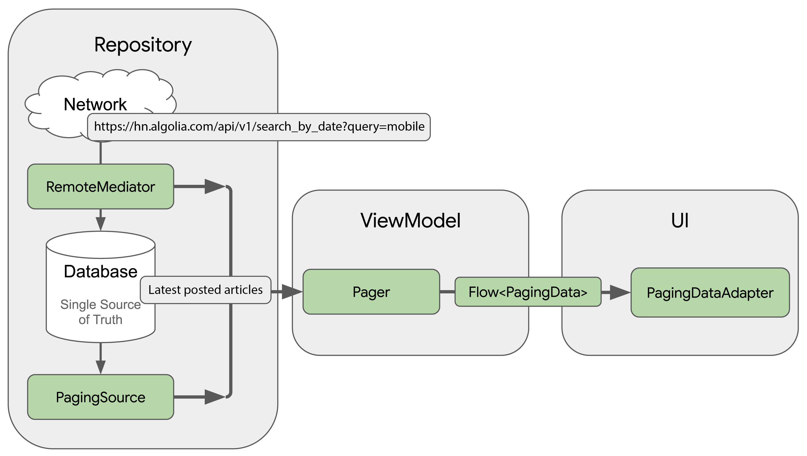

# Hacker News - Android App

[](/app/src/main/res/mipmap-xxxhdpi/ic_launcher.png)

Hacker News app shows recently posted articles about Android or iOS on Hacker News

<br />

## Features

- List view of articles about Android or iOS recently published in Hacker News
- Load latest articles when pull down (Pull to refresh)
- You can delete articles to not receive them anymore by sliding it to the left (Swipe to delete)
- You can view the articles within the application (WebView)

<br />

## Screenshots

[](/screenshots/listview.png)
[](/screenshots/swipe_to_delete.png)
[](/screenshots/load_more.png)
[](/screenshots/webview.png)

<br />

## Data Flow

[](/screenshots/data_flow.png)

<br />

## App Dependencies

- Retrofit2: for API integration
- Moshi: for Kotlin/JSON serialization/deserialization
- Coroutines: for asynchronous code execution

- Jetpack Components
  - LiveData
  - ViewModel
  - Navigation
  - DataBinding
  - Room: for SQLite Database Management
  - Paging3: custom RemoteMediator for loading data
  - Hilt: for Dependency Injection

<br />

## Source code structure

   ```cmd
      bmj.android.hackernews\   Application package
        :..api\                 Classes for Hacker News API Integration and API Response Model
        :..data\                Data repository and RemoteMediator
        :..db\                  Room Database and Data Access Objects (DAOs)
        :..di\                  Dependency Injection Modules
        :..model\               Data Model Clases and JSON adapters
        :..ui\                  UI components (Fragments, Adapters), Viewmodels
        :..util\                App utils and constants
   ```
   
<br />

## Requirements

- Android Studio 4.1.3 or higher
